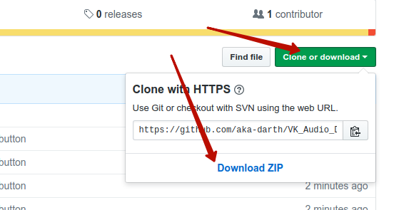
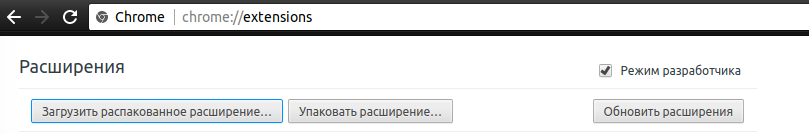

1. Скачайте ZIP архив:

2. Распакуйте.
3. Откройте chrome://extensions/ и поставьте галку "Режим разработчика"
4. Кнопка "Загрузить распакованное расширение"

5. Укажите путь, куда был распакован архив, и нажмите Ок.